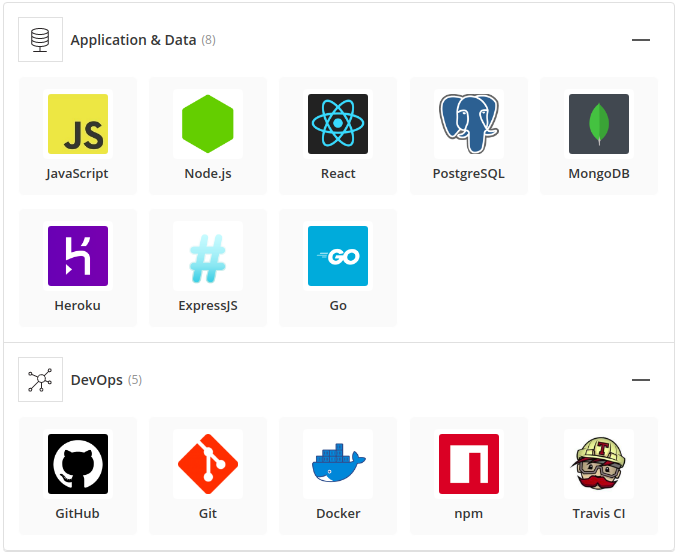

# Mac Store

[](#contributors)
[](https://travis-ci.org/cuongw/mac-store)
[](https://stackshare.io/cuongw/mac-store-stack)

> 🚀🛒 E-Commerce site using Microservice Architecture.

## Stack



## Quick start

```sh
# Install dependencies
$ cd server && yarn
$ yarn
# Run app
$ cd server && yarn start
$ yarn start
```

## Contributors

[](https://sourcerer.io/fame/tvc12/cuongw/mac-store/links/0)[](https://sourcerer.io/fame/tvc12/cuongw/mac-store/links/1)[](https://sourcerer.io/fame/tvc12/cuongw/mac-store/links/2)[](https://sourcerer.io/fame/tvc12/cuongw/mac-store/links/3)[](https://sourcerer.io/fame/tvc12/cuongw/mac-store/links/4)[](https://sourcerer.io/fame/tvc12/cuongw/mac-store/links/5)[](https://sourcerer.io/fame/tvc12/cuongw/mac-store/links/6)[](https://sourcerer.io/fame/tvc12/cuongw/mac-store/links/7)

## License

Apache © [cuongw](https://github.com/cuongw)
